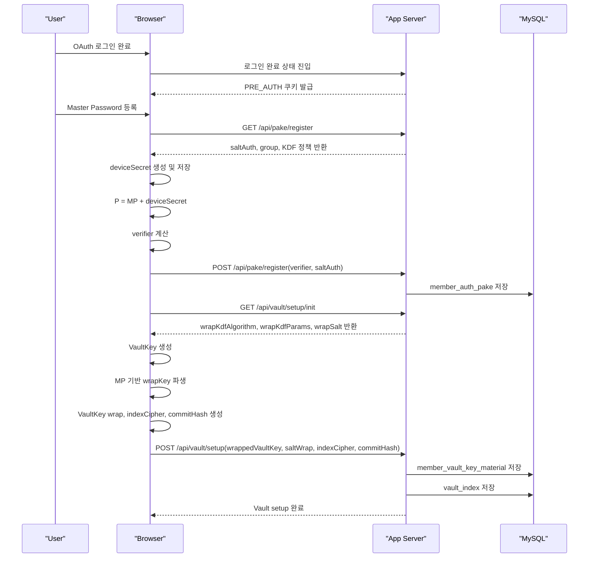
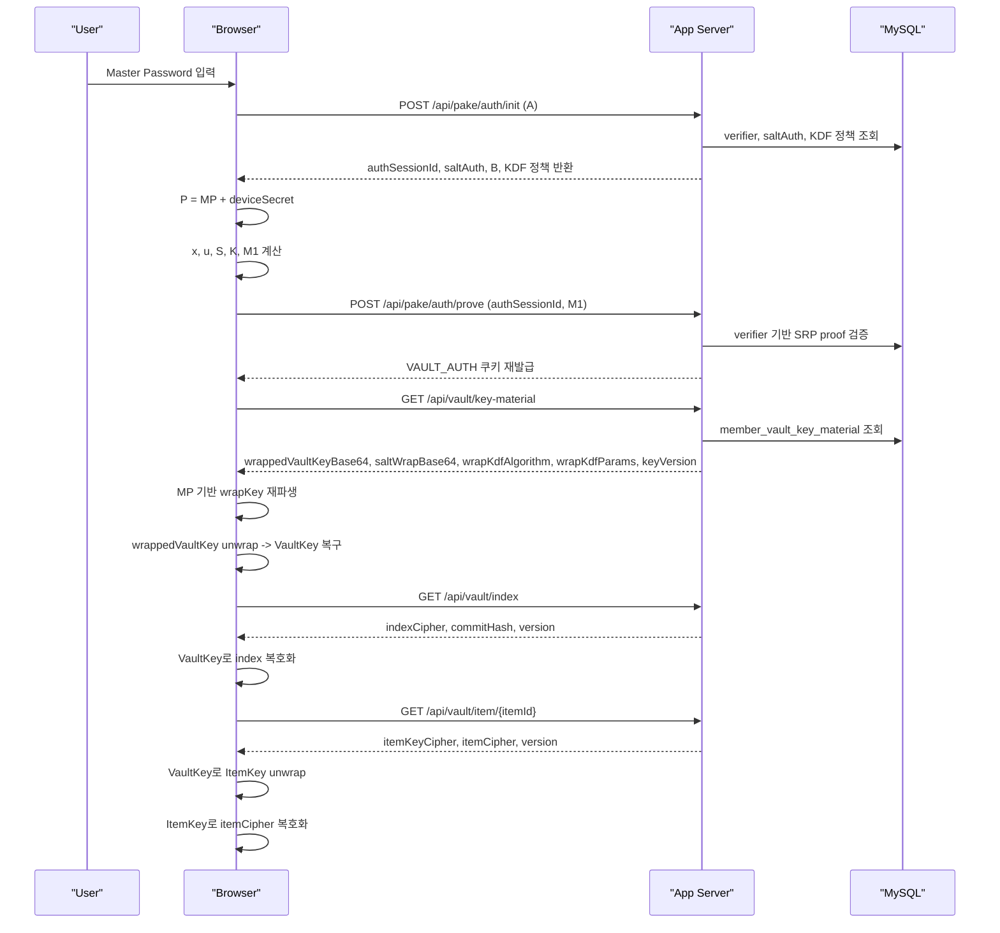

# VaultKey 인증 및 복호화 흐름

포트폴리오에는 Vault 접근을 단순 로그인 이후 데이터 조회로 설명하지 않고,  
`계정 인증 -> Vault 인증 -> VaultKey material 조회 -> 클라이언트 복호화`의 4단계 구조로 설명하는 것이 가장 자연스럽다.

주의할 점은 현재 코드 기준으로는 `SRP unlock -> VAULT_AUTH 승격 -> vault/index/item 조회`까지는 구현되어 있고,  
`wrappedVaultKeyBase64 / saltWrapBase64 / wrapKdfAlgorithm / wrapKdfParams`를 내려주는 DTO도 준비되어 있지만,  
`/api/vault/key-material` 형태의 조회 endpoint는 포트폴리오용 설계 흐름으로 분리해 설명하는 편이 적절하다는 점이다.

---

## 1. 초기 Vault 설정 흐름

### 포인트

1. 서버는 Master Password 원문을 저장하지 않고 `verifier`만 저장한다.
2. VaultKey는 서버가 들고 있는 키가 아니라, 클라이언트가 생성하고 wrap해서 저장하는 키다.
3. 서버는 `wrappedVaultKey`, `saltWrap`, `indexCipher`, `commitHash`만 저장한다.

---

## 2. Vault Unlock + VaultKey Retrieval 흐름

### 포인트

1. OAuth 로그인 성공만으로는 Vault를 열 수 없고, SRP 기반 step-up authentication을 한 번 더 통과해야 한다.
2. 서버는 `Vault 평문`, `VaultKey 원문`, `Master Password 원문`을 직접 알지 못한다.
3. 클라이언트는 `Master Password + deviceSecret` 기반으로 인증과 키 복구를 수행한다.
4. 실제 데이터 접근은 `VaultKey -> ItemKey -> ItemCipher` 계층으로 분리되어 있다.

---

## 3. 포트폴리오용 한 문단 설명

Zero Knowledge Vault는 로그인과 Vault 접근 권한을 분리한 구조로 설계했다. 사용자는 OAuth 로그인 이후 바로 Vault를 열 수 없고, 브라우저에서 Master Password와 deviceSecret을 이용해 SRP proof를 계산한 뒤 서버 검증을 통과해야만 `VAULT_AUTH` 권한을 획득한다. 이후 서버는 `wrappedVaultKey`, `saltWrap`, KDF 정책 등 key material만 내려주고, 실제 VaultKey 복구와 index/item 복호화는 전부 클라이언트에서 수행한다. 이를 통해 서버는 사용자 식별과 암호문 저장만 담당하고, Master Password와 Vault 평문은 끝까지 알지 못하는 zero-knowledge 구조를 유지한다.

---

## 4. 포트폴리오용 한 줄 요약

> OAuth 로그인 이후에도 SRP 기반 step-up authentication을 한 번 더 거친 뒤, 서버가 내려준 wrapped VaultKey를 클라이언트에서만 복구해 index와 item을 복호화하는 zero-knowledge 접근 구조를 설계했다.
